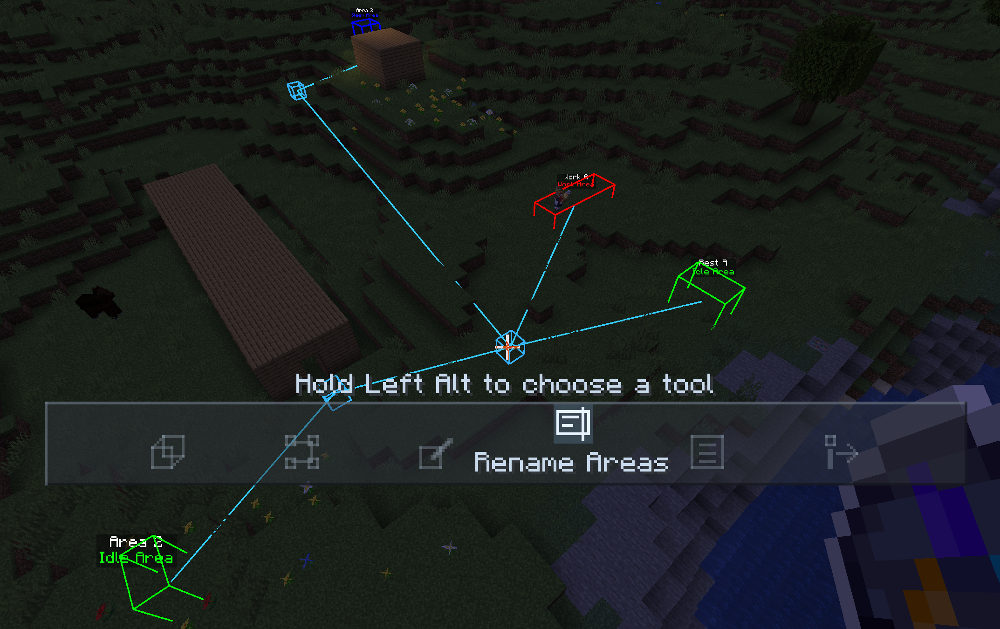

# Touhou Little Maid Custom Workspace

[简体中文](README.md)

Adds **Kappa's Smart Compass** to **Touhou Little Maid**, giving each maid her own cuboid work, rest and sleep areas. You can use waypoints to guide her around obstacles, or use a schedule to send her to different work areas in sequence, rotating after a specified number of working game ticks.

## Development Stage

If you encounter a stuck maid, unexpected area switching or UI problems, please include mod versions, reproduction steps, area/waypoint screenshots and relevant logs in [Issues](https://github.com/hyt2002/Touhou_Little_Maid_Custom_Workspace/issues). Whenever possible, provide materials that help reproduce the issue, such as a world save.

## Installation

| Component | Currently supported / tested version |
| --- | --- |
| Minecraft | 1.21.1 |
| Mod loader | NeoForge, developed and tested with version 21.1.219 |
| Required mod | [Touhou Little Maid](https://github.com/TartaricAcid/TouhouLittleMaid) 1.5.3 for NeoForge / Minecraft 1.21.1 |
| Client-only? | Install on both client and server |

## Usage

### Kappa's Smart Compass

**Kappa's Smart Compass** can be crafted shapelessly using one **Kappa Compass**, one **Redstone Dust** and one **Copper Ingot**.

Hold it in your main hand. Hold the tool-menu key (default **Left Alt**), scroll to select a tool, then release to confirm:

| Tool | Action |
| --- | --- |
| Cuboid selection | Select two block corners to add a cuboid area, initially marked as work |
| Route nodes | Choose a starting node, then create or connect mandatory waypoints |
| Mark areas | Click an existing cuboid to cycle work → rest → sleep |
| Rename areas | Click a cuboid to open its name editor; its name and type appear above the box |
| Schedule options | Click to open the work schedule and edit destinations and delay conditions |
| Apply to maid | Click your own maid to apply the settings |

### Cuboid Areas

Work areas are **red**, rest areas **green**, and sleep areas **blue**, matching the original Kappa Compass. Bounds include both endpoint block coordinates and must contain the maid's actual feet block; selecting only a solid floor does not count as arrival. Sleep areas should also include the bed's head block.

### Route Nodes

Waypoints can help a maid navigate around long walls, through entrances or across other terrain that requires several navigation stages.

1. Select “Route nodes” and use an existing area or waypoint as the starting node.
2. Walk to the position you want the maid to pass through. Click a position that is not an existing node, such as a block or air. The compass records **your current feet block**, creates a single-block node and connects it to the starting node.
3. The new node becomes the starting point for the next connection. Continue adding nodes, or use another existing node to connect the two.
4. Connect the route to the destination area, then apply it to the maid.

Attack an intermediate waypoint to remove it and its incident edges. Attacking an area in the route tool removes only its connections, preserving the area itself.

Maids prioritize the shortest graph route and navigate through each node, advancing only after actually entering its box. If no valid graph route exists, they navigate directly to the destination area. Outside all nodes, a maid first enters the nearest intermediate waypoint in the destination's connected component. Multiple rest or sleep areas are selected by total graph distance.

The shortest distance is calculated from game coordinates, without simulating the actual detour around obstacles. See [route details](docs/ROUTE-GRAPH.md).

### Work Schedules

“Schedule options” uses destination cards and separate condition editors, inspired by Create's train schedules. The current condition is **delay x game ticks**: after arriving at the specified work area, the maid starts counting working ticks, then proceeds to the next destination when the condition is met.

You can choose work areas, adjust delays, reorder, duplicate or remove entries, and run cyclically or once. With looping disabled, the maid finishes the last entry, stays in that work area and continues her original task. Without a custom schedule, work areas rotate in added order after **2400 working game ticks** each.

Travel, rest, sleep and inability to work pause progress. After confirming the editor to save the compass draft, reapply it to the maid.

### Deleting and Clearing

- Attack an existing cuboid in the cuboid tool to remove the area and related references. Sneak + Use cancels an unfinished selection.
- Sneak + Clear (default **Shift+V**) removes all work, rest and sleep cuboids in the cuboid tool, preserving intermediate waypoints. In the route tool it removes only intermediate points, preserving areas. Incident edges of removed nodes are also deleted.
- Sneak + Use your own maid in the apply tool to clear her custom areas and routes, restoring original area behavior.

## Compatibility

- **The original compass and Smart Compass can coexist.** For each schedule type, custom cuboids take priority when present; otherwise TLM's original compass positions and behavior apply. The original compass retains its existing functions.
- Maids still use TLM's original pathfinding.
- The addon changes areas and candidate target searches. Individual tasks and their area effects are still controlled by TLM or the corresponding task mod.
- Plans are dimension-specific. Searches do not actively load or generate chunks.

## Configuration

The configuration file is `config/touhou_little_maid_custom_workspace-common.toml`.

| Setting | Default | Purpose |
| --- | ---: | --- |
| `workTicksPerArea` | 2400 | Default rotation budget and initial delay for new schedule entries |
| `travelTimeoutTicks` | 0 | Travel timeout in game ticks; 0 disables timeout skipping |
| `maxAreasPerMaid` | 16 | Combined limit for work, rest and sleep cuboids |
| `maxAreaEdge` | 64 | Maximum length of each axis of an area |
| `maxAreaVolume` | 131072 | Maximum volume of an area |
| `candidateBudget` | 2048 | Candidate block budget per task search |

## Asset License and Credits

**The project's code is licensed under [MIT](LICENSE).** The Smart Compass texture artwork is adapted from **[Touhou Little Maid](https://github.com/TartaricAcid/TouhouLittleMaid)** assets. The original assets belong to **TLM's original author, TartaricAcid**, and retain **CC BY-NC-SA 4.0**.
